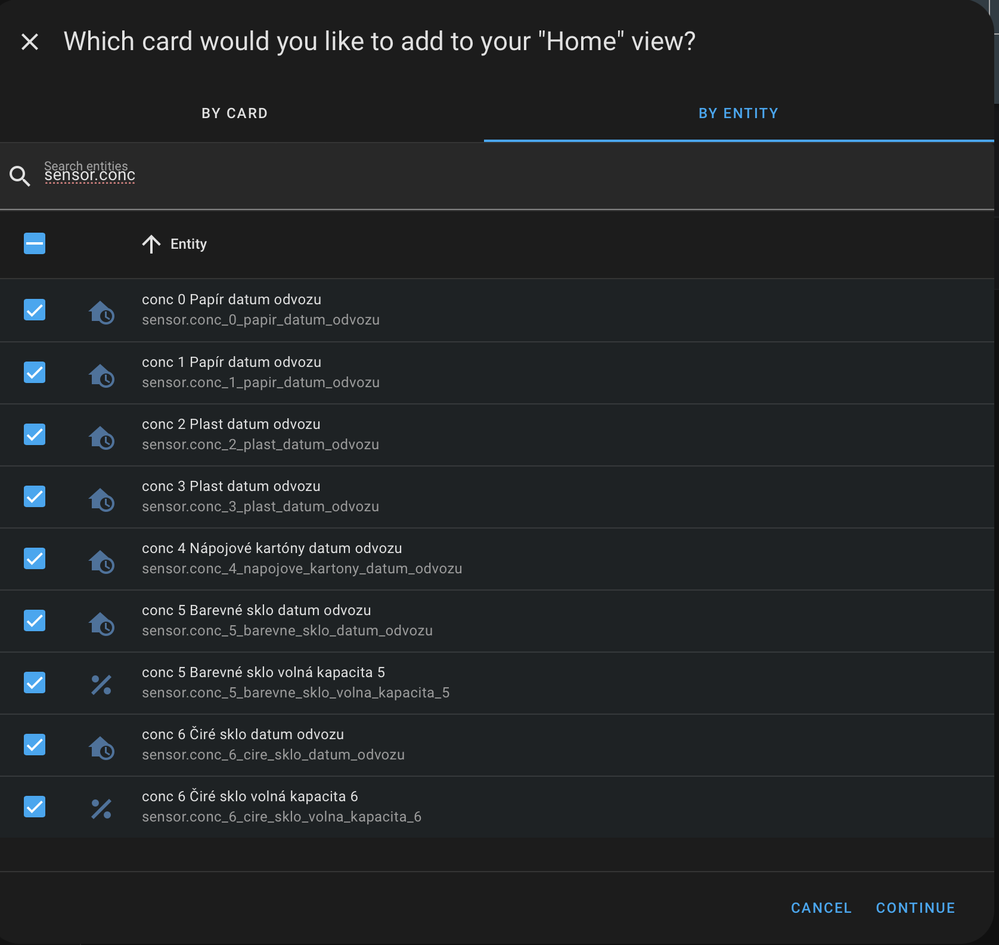
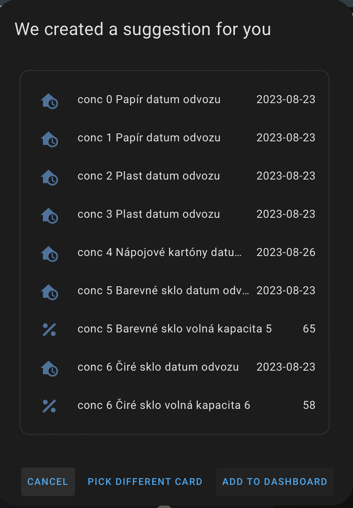

# Prague waste separation point for HA using GolemioAPI


## Krok 1 - Registrace API Golemio:
Registrace: [https://api.golemio.cz/api-keys/auth/sign-up](https://api.golemio.cz/api-keys/auth/sign-up)  
## Krok 2 - Zjištěni ID skupiny kontejnerů:
1. [Golemio API](https://api.golemio.cz/v2/docs/openapi/#/)
2. Klikni na zelený rámeček s "Authorize 🔒" a vlož token z kroku 1
3. [Sortedwastedstation API call](https://api.golemio.cz/v2/docs/openapi/#/♻%EF%B8%8F%20Waste%20Collection/getWCStations)
4. Najdi ID skupiny kontejnerů
- Do **latlng** zadej souřadnice - ideálně přímo vybraného kontejneru (možno získat na mapy.cz) v zobrazeném formátu. Např. "50.0890,14.4168" 
- Do **range** zadej rozsah, ideálně "50" (pokud jsi zadal souřadnice kontejnerů)
- **districts** je možné nechat prazdné
- z **accessibility** odeber předvyplněné řádky pomocí symbolu **-** vpravo
- **limit** je možné nastavit na "1"
- **offset** je nechte na "0"
- **onlyMonitored** - ideálně nastavit na "false"
- **id** - prázdné
- **ksnkoId** - prázdné
5. Kliknout na Execute
	Curl by měl vypadat cca. takto: 
	```
	curl -X 'GET' 'https://api.golemio.cz/v2/sortedwastestations?latlng=50.0890%2C14.4168&range=50&limit=3&offset=0&onlyMonitored=false' -H 'accept: application/json' -H 'X-Access-Token: tokentokentokentokentokentokentokentokentoken'
	```
6. V části **Response body** najdi (CTRL + F)  skupinu kontejnerů podle ulice. Např. "Valentinská" a zkopíruj hodnotu "id", které je o dva řádky výše. V tomto případě 3497.
	```json
        "district": "praha-1",
        "id": 3497,
        "is_monitored": true,
        "name": "Valentinská 1/13",
        "station_number": "0001/ 001",
        "updated_at": "2023-08-22T05:25:28.292Z"
	```
	


## Krok 3 - Konfigurace HA:  
- vložit token z kroku do secrets.yaml
	```yaml 
	golemio: "<TOKEN>"
	```
- nakonfigurovat senzor configuration.yaml 
	```yaml 
	- platform: golemio
	  name: conc
	  token: !secret golemio
	  container_id: 3497
	```
- Restartovat HA
- Vytvořit kartu entity (příklad záleží na počtu kontejnerů). 
Dejte přidat novou kartu, "Podle entity" a začněte psát: "sensor.conc" - zobrazí se všechny vytvořené senzory pro zadanou lokaci. Všechny vyberte a dejte Pokračovat. 
- Vytvoří se nová karta Entity se všemi hodnotami. Doporučujeme si senzory přejmenovat na typ odpadu.
	Příklad:
	```yaml 
	type: entities
	entities:
	- entity: sensor.conc_0_papir_datum_odvozu
	  name: Papír
	- entity: sensor.conc_1_papir_datum_odvozu
	  name: Papír
	- entity: sensor.conc_2_plast_datum_odvozu
	  name: Plast
	- entity: sensor.conc_3_plast_datum_odvozu
	  name: Plast
	- entity: sensor.conc_4_napojove_kartony_datum_odvozu
	  name: Nápojové kartóny
	- entity: sensor.conc_5_barevne_sklo_datum_odvozu
	  name: Barevné sklo
	- entity: sensor.conc_5_barevne_sklo_volna_kapacita_5
	  name: Barevné sklo
	- entity: sensor.conc_6_cire_sklo_datum_odvozu
	  name: Čiré sklo
	- entity: sensor.conc_6_cire_sklo_volna_kapacita_6
	  name: Čiré sklo
	```




# Řešení problémů
1. Stáhnout poslední verzi
2. Zakomentovat senzory 
   ```yaml
   - platform: golemio
    #   name: conc
    #   token: !secret golemio
    #   container_id: 3497
    ```
3. Restartovat HA
4. Odebrání nedostupných entit
    - Nastavení > Zařízení a služby > Entity 
    - Odebrat nedostupné entity (ikona vykřičník v červeném kolečku)
    - Odkomentovat senzory
    ```yaml
    - platform: golemio
        name: conc
        token: !secret golemio
        container_id: 3497 
    ```
5. Restartovat HA