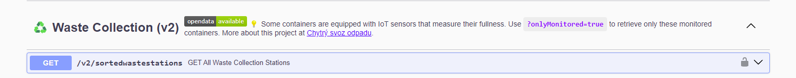
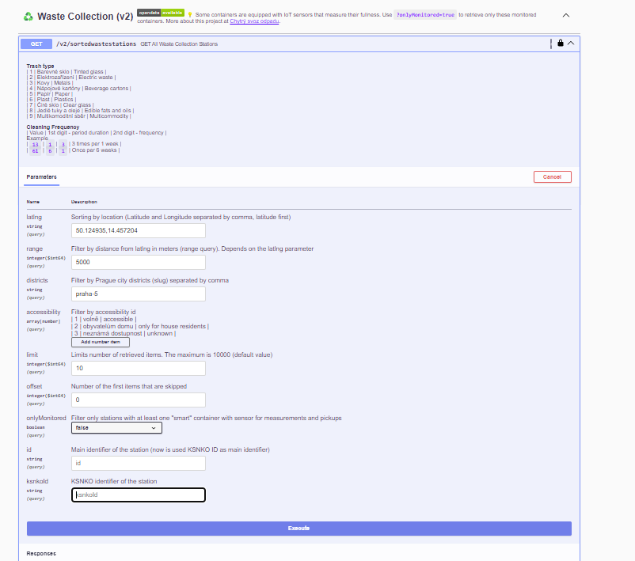
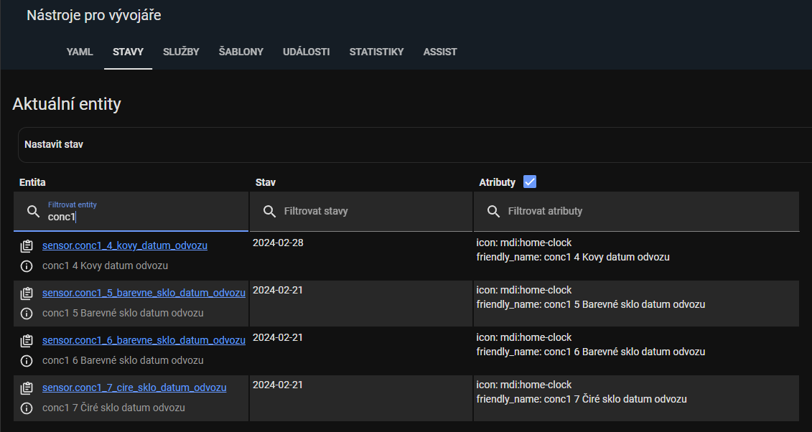
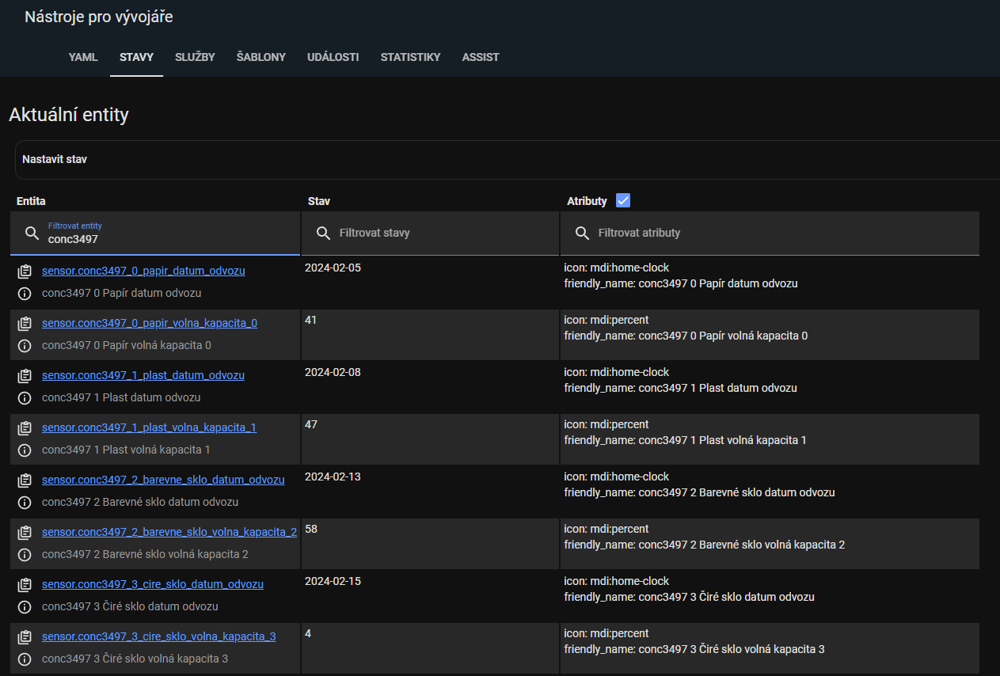
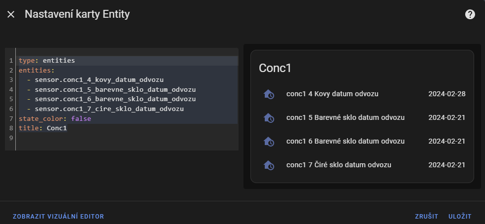
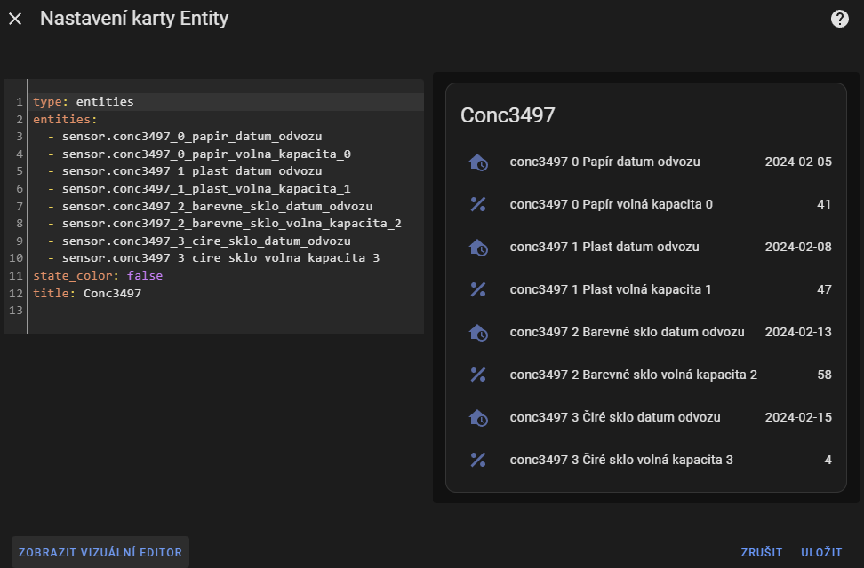
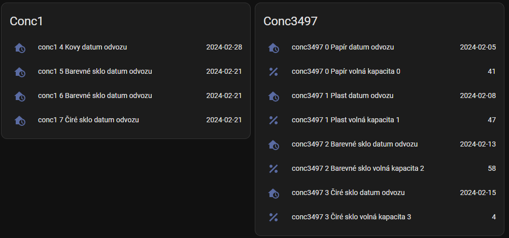
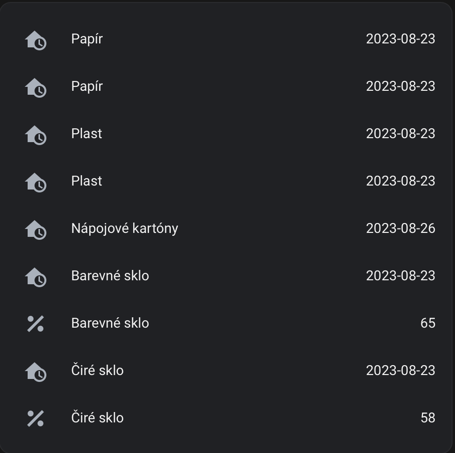

# Prague waste separation point for HA using GolemioAPI


## Krok 1 - Registrace API Golemio:
Registrace: [https://api.golemio.cz/api-keys/auth/sign-up](https://api.golemio.cz/api-keys/auth/sign-up)  
po registraci se vegeneruje token, ten si uložte budeme ho potřebovat.   
## Krok 2 - Zjištěni ID skupiny kontejnerů:
1. [Golemio API](https://api.golemio.cz/v2/docs/openapi/#/)
2. Klikni na zelený rámeček s `Authorize 🔒` a vlož token z kroku 1
3. Vyber `Waste Collection (v2)` klikni na první dotaz `(Get All Waste Collection Station)`
  
4. Kliknout na `Try it out` a vyplnit požadované informace  
  
- Do `latlng` zadej souřadnice - ideálně přímo vybraného kontejneru (možno získat na mapy.cz) v zobrazeném formátu. Např. "50.0890,14.4168" 
- Do `range`zadej rozsah, ideálně "50" (pokud jsi zadal souřadnice kontejnerů)
- `districts` je možné nechat prazdné
- z `accessibility` odeber předvyplněné řádky pomocí symbolu **-** vpravo
- `limit` je možné nastavit na "1"
- `offset`je nechte na "0"
- `onlyMonitored` - ideálně nastavit na "false"
- `id` - prázdné
- `ksnkoId` - prázdné

5. Kliknout na Execute  
   - Curl by měl vypadat cca. takto: 
	```
	curl -X 'GET' 'https://api.golemio.cz/v2/sortedwastestations?latlng=50.0890%2C14.4168&range=50&limit=3&offset=0&onlyMonitored=false' -H 'accept: application/json' -H 'X-Access-Token: tokentokentokentokentokentokentokentokentoken'
	```
6. V části **Response body** najdi (CTRL + F)  skupinu kontejnerů podle ulice. Např. "Valentinská" a zkopíruj hodnotu "id", které je o dva řádky výše. V tomto případě 3497.  

	```json
        "district": "praha-1",
        "id": 3497,
        "is_monitored": true,
        "name": "Valentinská 1/13",
        "station_number": "0001/ 001",
        "updated_at": "2023-08-22T05:25:28.292Z"
	```
## Krok 3 - Konfigurace HA:  
- vložit token z kroku do secrets.yaml
	```yaml 
	golemio: "<TOKEN>"
	```
- nakonfigurovat senzory v configuration.yaml 
	```yaml
	sensor: 
	 - platform: golemio
	   name: conc3497 # pod tímto jménem můžete dohledat požadovanou entitu (sensor.conc3497_0_papir_datum_odvozu)
	   token: !secret golemio
	   container_id: 3497

	- platform: golemio
	  name: conc1 # pod tímto jménem můžete dohledat požadovanou entitu (sensor.conc1_4_kovy_datum_odvozu)
	  token: !secret golemio
	  container_id: 1
	```
- V případe, že používáte v hlavním configuration.yaml funkci include sensor: `!include_dir_merge_list sensors/` je nutné vynechat 1. řádek `sensors:` a dodržet formátování.  

	```yaml
	- platform: golemio
	  name: conc3497 
	  token: !secret golemio
	  container_id: 3497
	- platform: golemio
	  name: conc1
	  token: !secret golemio
	  container_id: 1
	```
- ***Restartovat HA***

## Krok 4 - nastavení karet
Zkontrolujte stav entity v `Nástroje pro vývojáře`.  
`Senzor conc1`  
  

`Senzor conc3497`  
  

### Vytvořit kartu entity  
Přidat novou kartu, "Podle entity" a začněte psát: "sensor.conc" - zobrazí se všechny vytvořené senzory pro zadanou lokaci.  
- Vytvořit novou kartu Entity pro sensor1.  

	### Příklad 1:
	`Senzor conc1`
	```yaml 
		type: entities
		entities:
		  - sensor.conc1_4_kovy_datum_odvozu
		  - sensor.conc1_5_barevne_sklo_datum_odvozu
		  - sensor.conc1_6_barevne_sklo_datum_odvozu
		  - sensor.conc1_7_cire_sklo_datum_odvozu
		state_color: false
		title: Conc1
	```  
	  
- Vytvořit novou kartu Entity pro `sensor3497`.  	
	### Příklad 2:
	`Senzor conc3497`
	```yaml 
		type: entities
		entities:
		  - sensor.conc3497_0_papir_datum_odvozu
		  - sensor.conc3497_0_papir_volna_kapacita_0
		  - sensor.conc3497_1_plast_datum_odvozu
		  - sensor.conc3497_1_plast_volna_kapacita_1
		  - sensor.conc3497_2_barevne_sklo_datum_odvozu
		  - sensor.conc3497_2_barevne_sklo_volna_kapacita_2
		  - sensor.conc3497_3_cire_sklo_datum_odvozu
		  - sensor.conc3497_3_cire_sklo_volna_kapacita_3
		state_color: false
		title: Conc3497
	```  
	 
- Doporučujeme si senzory přejmenovat na typ odpadu.  
## Konečný výsledek  
  


# Řešení problémů
1. Stáhnout poslední verzi
2. Zakomentovat senzory 
   ```yaml
   - platform: golemio
    #   name: conc
    #   token: !secret golemio
    #   container_id: 3497
    ```
3. Restartovat HA
4. Odebrání nedostupných entit
    - Nastavení > Zařízení a služby > Entity 
    - Odebrat nedostupné entity (ikona vykřičník v červeném kolečku)
    - Odkomentovat senzory
    ```yaml
    - platform: golemio
        name: conc3497
        token: !secret golemio
        container_id: 3497 
    ```
5. Restartovat HA
